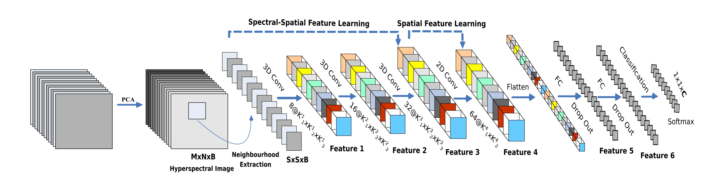
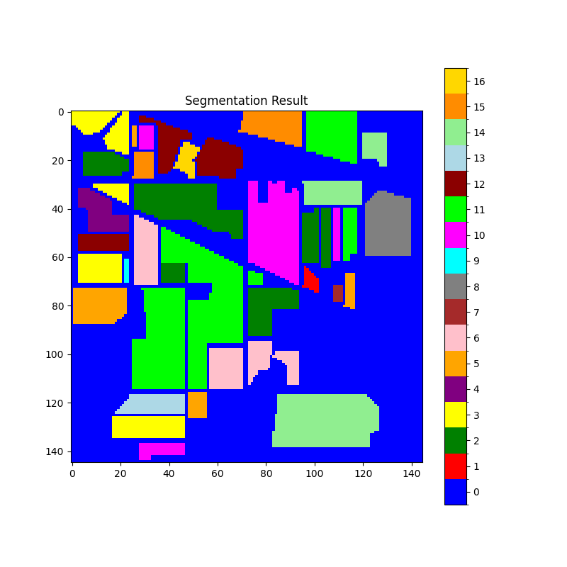
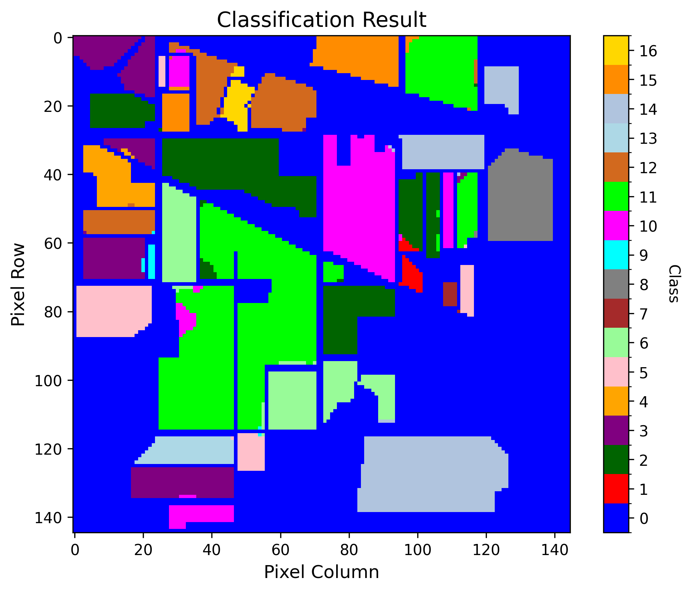

# 高光谱图像分类网络

## 网络: 3D&2D CNN (HybridSN with Batch Normalization)

本项目实现了一个混合3D与2D卷积神经网络（CNN）用于高光谱图像（HSI）分类。该网络基于 HybridSN 论文中的思想，并通过加入批量归一化（Batch Normalization, BN）层进行了改进，以期获得更稳定的训练过程、更快的收敛速度以及更优的泛化能力。

- **网络结构图**: 
- **论文原始链接**: [https://ieeexplore.ieee.org/document/8736016](https://ieeexplore.ieee.org/document/8736016)
- **论文原文**: 详见项目内 `HybridSN_Exploring_3-D2-D_CNN_Feature_Hierarchy_for_Hyperspectral_Image_Classification.pdf` 
- **代码主要参考链接**: [https://wxler.github.io/2021/01/05/173233/](https://wxler.github.io/2021/01/05/173233/)

## 项目特点与改进

- **混合卷积结构**: 有效结合3D CNN提取光谱-空间联合特征的能力和2D CNN进一步学习抽象空间特征的优势。
- **批量归一化 (BN)**: 在每个卷积层后引入BN层，有助于缓解梯度消失/爆炸问题，加速模型收敛，并提升模型的泛化性能。
- **模块化代码结构**: 项目代码经过重构，实现了配置、数据处理、模型定义、训练和预测等模块的分离，提高了代码的可读性、可维护性和可扩展性。
- **处理类别不平衡**: 在训练过程中综合使用了加权损失函数 (Weighted CrossEntropyLoss) 和针对少数类的过采样策略 (`WeightedRandomSampler`)，以提升模型在不平衡数据集上的表现，特别是对少数类别的识别能力。

## 数据集

- **采用数据集**: Indian Pines (IP) 数据集。
- **数据集介绍和获取**: 可通过以下仓库获取更多高光谱图像数据集信息：[Hyperspectral_Image_Datasets_Collection](https://github.com/Sellifake/Hyperspectral_Image_Datasets_Collection)
- **数据划分**: 以下结果基于 10% 样本用于训练，90% 样本用于测试的划分。

## 环境依赖

主要的Python库依赖包括：
- PyTorch
- NumPy
- Scikit-learn
- SciPy
- Matplotlib

详细依赖请见 `requirements.txt` 文件。

## 如何运行

1.  **准备环境**:
    * 克隆或下载本项目到本地。
    * 确保已安装 Python (3.8+)。
    * 在项目根目录下，通过 `pip install -r requirements.txt` 安装所需依赖。
2.  **准备数据**:
    * 以Indian Pines 数据集为例：将`.mat` 文件 ( `Indian_pines_corrected.mat` 和 `Indian_pines_gt.mat`) 放置在 `./data/` 目录下。
3.  **配置参数**:
    * 所有重要的超参数、路径设置、数据划分比例等均可在 `./configs/config.py` 文件中进行修改。
4.  **训练模型**:
    * 在项目根目录下运行命令: `python train.py`
    * 训练好的模型权重将默认保存在 `./outputs/final_model.pth` (或配置文件中指定的名称)。
5.  **进行预测与可视化**:
    * 训练完成后，在项目根目录下运行命令: `python predict.py`
    * 该脚本会加载训练好的模型，对整个数据集中的带标签像素进行预测，计算评估指标，并将分类结果图保存在 `./outputs/` 目录下 (例如 `Indian_pines_classification_map_custom_color.png`)，同时也会显示该图。

## 结果展示 (基于10%训练集，90%测试集)

- **真实标签图 (GT)**:
  

- **预测结果图 (Prediction)**:
  


## 分类结果 (基于10%训练集，90%测试集)

以下是在 Indian Pines 数据集上，使用10%数据进行训练（结合加权损失和过采样），并在剩余90%数据上测试得到的分类评估指标：

```plaintext
              precision    recall  f1-score   support

    Class 0     0.7667    1.0000    0.8679        46
    Class 1     0.9948    0.9433    0.9684      1428
    Class 2     0.9915    0.9831    0.9873       830
    Class 3     0.9792    0.9916    0.9853       237
    Class 4     0.9959    0.9938    0.9948       483
    Class 5     0.9667    0.9932    0.9797       730
    Class 6     0.9655    1.0000    0.9825        28
    Class 7     0.9958    1.0000    0.9979       478
    Class 8     0.7407    1.0000    0.8511        20
    Class 9     0.9478    0.9907    0.9688       972
   Class 10     0.9731    0.9593    0.9662      2455
   Class 11     0.9763    0.9713    0.9738       593
   Class 12     1.0000    0.9951    0.9976       205
   Class 13     0.9937    1.0000    0.9968      1265
   Class 14     0.9625    0.9974    0.9796       386
   Class 15     0.8911    0.9677    0.9278        93

   accuracy                         0.9770     10249
  macro avg     0.9463    0.9867    0.9641     10249
weighted avg     0.9778    0.9770    0.9771     10249