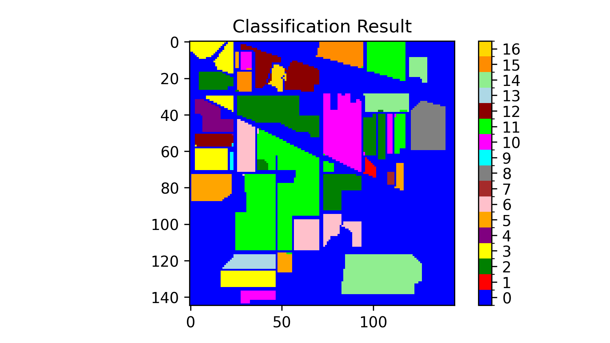

# 高光谱图像分类网络

## 网络1: 3D CNN

- **网络结构图**: 
    - 网络结构图文件路径: `Classification_Network\3D_CNN`
  
- **论文原始链接**: [https://ieeexplore.ieee.org/document/8736016](https://ieeexplore.ieee.org/document/8736016)

- **论文原文**: 
    - 论文文件路径: [pdf](./3D_CNN/HybridSN_Exploring_3-D2-D_CNN_Feature_Hierarchy_for_Hyperspectral_Image_Classification.pdf)

## 改进
- 在原有网络基础上加入了BN层（Batch Normalization），使得训练更加稳定、收敛速度更快，提升了模型的泛化能力。

- **具体代码介绍**: 详见 [Introduction.md](./3D_CNN/Introduction.md)

## 数据集
- **采用数据集**: IP数据集
    - 数据集介绍和获取: [Hyperspectral_Image_Datasets_Collection](https://github.com/Sellifake/Hyperspectral_Image_Datasets_Collection)

## 结果展示
- **GT图像**: 
- **预测结果图**: 


## 分类结果

```plaintext
              precision    recall  f1-score   support

         0.0     0.9762    1.0000    0.9880        41
         1.0     0.9959    0.9549    0.9750      1285
         2.0     0.9973    1.0000    0.9987       747
         3.0     0.9907    1.0000    0.9953       213
         4.0     1.0000    0.9908    0.9954       435
         5.0     0.9939    0.9909    0.9924       657
         6.0     1.0000    1.0000    1.0000        25
         7.0     0.9977    1.0000    0.9988       430
         8.0     0.9474    1.0000    0.9730        18
         9.0     1.0000    0.9909    0.9954       875
        10.0     0.9722    0.9973    0.9846      2210
        11.0     0.9866    0.9644    0.9754       534
        12.0     1.0000    1.0000    1.0000       185
        13.0     0.9921    0.9930    0.9925      1139
        14.0     0.9830    1.0000    0.9914       347
        15.0     0.8478    0.9286    0.8864        84

    accuracy                         0.9875      9225
   macro avg     0.9801    0.9882    0.9839      9225
weighted avg     0.9878    0.9875    0.9875      9225

